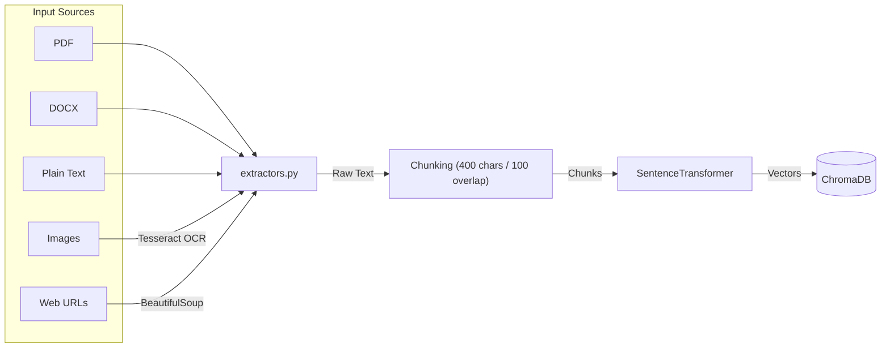

# DocuFlux AI - Dual-Mode RAG Assistant

[](https://huggingface.co/spaces/arcreactor19/DocuFlux-AI)

A production-grade, local-first RAG (Retrieval-Augmented Generation) assistant that supports both a persistent built-in knowledge base and ephemeral user-uploaded document sessions. Powered by a multi-provider LLM selector, agentic web fallback, and cloud-persisted storage.

## Key Features

- **Cloud Persistence and Automated Sync**: Leverages Hugging Face Storage Buckets to persist vector databases and session data across container restarts and sleep cycles.
- **Dual-Mode Intelligence**:
  - **Default Mode**: Queries a pre-built static knowledge base (company documentation).
  - **Custom Mode**: Upload your own files or paste web links for instant, session-isolated analysis.
- **Multi-Provider LLM Selector**: Switch between LLM providers at runtime from the UI. Only providers with configured API keys are shown:
  - **Local (LM Studio)**: Fully offline, no API key required.
  - **Groq - Llama 3.3 70B**: High-performance free tier.
  - **Mistral - Small**: Reliable free tier via La Plateforme.
- **Agentic Web Fallback**: If the local database has no relevant answer, the system automatically queries DuckDuckGo and uses live web results as context.
- **AI Auto-Classification**: Automatically detects if you are asking a question (routing to RAG) or providing context (routing to ingestion).
- **Strict Anti-Hallucination**: Grounded answering logic that explicitly refuses to answer if relevant context is missing.
- **Robust Multi-Format Extraction**: Support for PDF, Word (.docx), Plain Text, Images (via Tesseract OCR), and Web URLs.
- **Isolated User Sessions**: Every browser tab receives a unique session ID and a private, isolated vector database to ensure data privacy.

## Project Structure

```
DocuFlux AI/
├── app.py               # Main entry point and UI configuration
├── packages.txt         # System dependencies (OCR)
├── requirements.txt
├── README.md
├── .env                 # Local secrets and configuration
│
├── core/                # RAG and Storage Logic
│   ├── config.py        # Centralized configuration and registry
│   ├── answer.py        # Retrieval and answering pipeline
│   ├── ingest.py        # Default knowledge base ingestion
│   ├── extractors.py    # Multi-format document parsing
│   ├── sync_manager.py  # Hugging Face Storage Bucket integration
│   ├── session_manager.py  # User session lifecycle and client caching
│   └── session_ingest.py   # Per-session vector storage
│
├── data/
│   ├── raw/             # Source markdown files for the knowledge base
│   ├── sessions/        # Local storage for active user databases
│   └── vector_db/       # Persistent Chroma database
│
└── evaluation/          # Benchmarking and Quality Assurance
    ├── eval.py          # Metric calculation (MRR, nDCG, Accuracy)
    ├── test.py          # Batch evaluation loader
    └── tests.jsonl      # Ground-truth test dataset
```

## Setup and Installation

### 1. Prerequisites
- **Python 3.10+**
- **LLM**: LM Studio (local) or API keys for Groq/Mistral.
- **Tesseract OCR (Optional)**: Required for image extraction.
  - Windows: winget install -e --id UB-Mannheim.TesseractOCR
  - Linux: Installed automatically via packages.txt.

### 2. Install Dependencies
```bash
python -m venv .venv
.venv\Scripts\activate       # Windows
# source .venv/bin/activate  # Linux / macOS

pip install -r requirements.txt
```

### 3. Environment Configuration
Create a `.env` file in the root directory:

```env
# API Keys
GROQ_API_KEY=gsk_...
MISTRAL_API_KEY=...

# Cloud Persistence (Optional)
HF_TOKEN=hf_...
HF_BUCKET_URI=hf://buckets/username/bucket-name

# Local LLM
LM_STUDIO_BASE=http://127.0.0.1:1234/v1
```

### 4. Initialize the Knowledge Base
Place your markdown files in `data/raw/` then run:
```bash
python -m core.ingest
```

### 5. Launch the Application
```bash
python app.py
```
Open `http://127.0.0.1:7860` in your browser.

## Persistence Architecture

The system uses a local-first storage strategy. To solve the file-locking issues common in cloud container environments, DocuFlux performs the following:

1. **Startup**: Restores existing databases from the Hugging Face Storage Bucket to the local fast disk.
2. **Execution**: All vector operations occur on the local disk to ensure high performance and POSIX file-locking compliance.
3. **Background Sync**: A daemon thread performs a bidirectional sync with the Storage Bucket every 5 minutes, ensuring your data survives if the Space restarts or goes to sleep.

## Data Flow

### Ingestion Pipeline


### Mode Architecture


## Evaluation Dashboard

The assistant includes an Evaluation tab to benchmark performance using the `evaluation/tests.jsonl` dataset.

### Retrieval Metrics
- **MRR (Mean Reciprocal Rank)**: Quality of the top retrieved result.
- **nDCG**: Effectiveness of the result ranking.
- **Keyword Coverage**: Verification of essential information retrieval.

### Answer Metrics (AI-as-a-Judge)
Scores responses on a 1-5 scale across:
- **Accuracy**: Factual correctness based on context.
- **Completeness**: Coverage of all user requirements.
- **Relevance**: Conciseness and focus.

## System Limits
- **Max File Size**: 10 MB per file.
- **Max Session Size**: 50 MB total per user.
- **Context Window**: 4,000 characters of retrieved context.
- **Persistence**: Databases are synced to cloud storage every 300 seconds.
