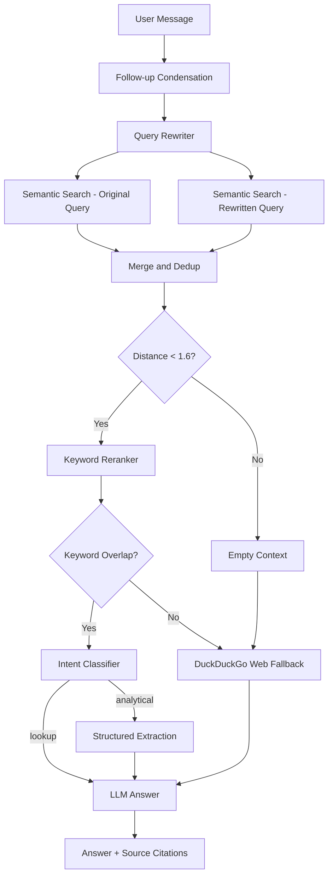
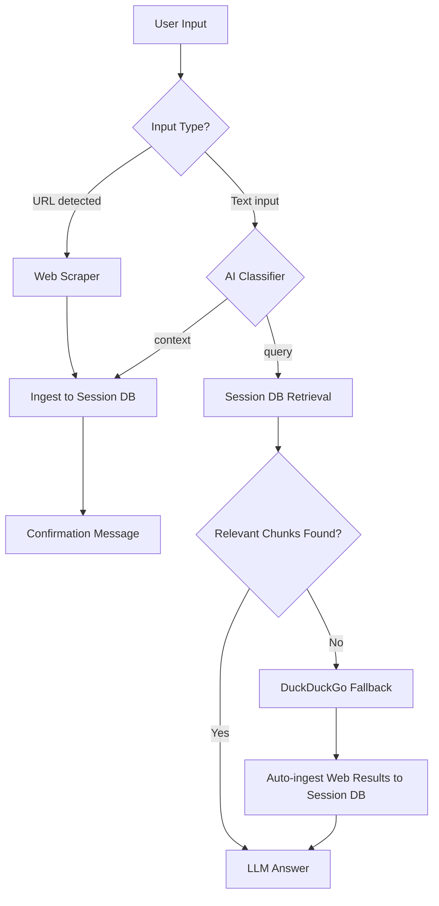

# DocuFlux AI - Dual-Mode RAG Assistant

[](https://huggingface.co/spaces/arcreactor19/DocuFlux-AI)

A production-grade Retrieval-Augmented Generation (RAG) assistant with two distinct operating modes — a persistent built-in knowledge base and a fully isolated per-session document workspace. Built on ChromaDB, SentenceTransformers, and an OpenAI-compatible multi-provider LLM layer.

---

## Table of Contents

1. [Modes at a Glance](#modes-at-a-glance)
2. [Key Features](#key-features)
3. [Project Structure](#project-structure)
4. [RAG Pipeline Deep Dive](#rag-pipeline-deep-dive)
5. [Setup and Installation](#setup-and-installation)
6. [LLM Provider Configuration](#llm-provider-configuration)
7. [Evaluation Dashboard](#evaluation-dashboard)
8. [System Limits and Configuration](#system-limits-and-configuration)

---

## Modes at a Glance

DocuFlux AI exposes two modes from a single UI toggle. They share the same retrieval and answering pipeline (`core/answer.py`) but target different vector databases and have different data isolation guarantees.

| | Default Mode | Custom Mode |
|---|---|---|
| **Knowledge Source** | Pre-built static KB (`data/vector_db/`) | Per-session ephemeral DB (`data/sessions/<uuid>/`) |
| **Data Persistence** | Permanent — committed to repository | Wiped on reset or server shutdown |
| **Accepts Uploads** | No | Yes — PDF, DOCX, TXT, MD, PNG, JPG, JPEG |
| **Accepts URLs** | No | Yes — scraped and indexed in real time |
| **Accepts Pasted Text** | No | Yes — AI-classified before ingesting |
| **Web Fallback** | Yes — DuckDuckGo when KB has no answer | Yes — triggered when session DB has no relevant chunks |
| **Chat History** | Persists while on Default tab | Persists while on Custom tab — separate from Default |
| **Privacy** | Shared KB accessible to all users | Fully isolated per browser session |

---

## Key Features

### Dual-Mode Intelligence
- **Default Mode** queries a pre-built static knowledge base (company documentation, contracts, products). Use it as a domain-specific expert assistant with zero setup.
- **Custom Mode** creates a private, isolated vector database per browser session. Anything you upload, scrape, or paste becomes the sole source of truth for your conversation.

### Multi-Provider LLM Selector
Switch providers at runtime from the UI dropdown. Only providers with a valid API key are shown:
- **Local (LM Studio)** — Fully offline, no API key required.
- **Groq - Llama 3.3 70B** — Free tier, 14,400 requests/day.
- **Mistral - Small** — Free tier via La Plateforme.

On HuggingFace Spaces, the Local provider is hidden automatically since LM Studio cannot run there.

### Agentic Web Fallback (DuckDuckGo)
When no relevant context is found in the active database, the system automatically falls back to a live DuckDuckGo web search. It uses two strategies in sequence:
1. **HTML scraping** (`html.duckduckgo.com`) — works even in sandboxed environments.
2. **`ddgs` API** — faster JSON-based search as a secondary path.

Web-sourced answers are clearly labeled with a disclaimer. Web results fetched in Custom Mode are also auto-ingested into the session database for future retrieval.

### Agentic Query Pipeline
Each user query passes through several intelligent stages before reaching the LLM:
1. **Follow-up Condensation** — Pronouns and short follow-ups are rewritten into standalone questions using recent conversation history.
2. **Query Rewriting** — The standalone question is rephrased into a tighter KB search query.
3. **Dual Retrieval** — Both the original and rewritten queries are embedded and searched in parallel against ChromaDB.
4. **Deduplication and Merge** — Results from both searches are merged without duplicates.
5. **Keyword Reranking** — Chunks are scored by keyword overlap with the query and sorted.
6. **Relevance Gate** — A final post-rerank check discards chunks with zero keyword overlap, preventing irrelevant context from reaching the LLM.
7. **Intent Classification** — The query is classified as `lookup` or `analytical`. Analytical queries trigger a structured pre-extraction step before the final answer.

### AI Auto-Classification (Custom Mode)
When you type or paste text in Custom Mode, the system classifies your input before acting:
- **Short input (< 100 chars) or ends with `?`** — treated as a question, routed to retrieval.
- **Long input (> 500 chars)** — treated as document content, ingested immediately.
- **Medium input (100–500 chars)** — classified by the LLM; falls back to heuristics if the LLM is unreachable.

### Strict Anti-Hallucination
The LLM prompt enforces strict grounding rules:
- Answer only from retrieved context.
- Explicitly cite the source document for every major claim.
- Disclose conflicts if multiple sources disagree.
- Refuse to answer if context is insufficient — no fabrication from training data.

### Multi-Format Document Extraction
| Format | Library | Notes |
|---|---|---|
| PDF | PyMuPDF (`fitz`) | Full text extraction, page-by-page |
| DOCX | `python-docx` | Paragraph-level extraction |
| Images (PNG, JPG, JPEG) | `pytesseract` + Pillow | Requires Tesseract OCR binary |
| Plain Text / Markdown | Built-in | UTF-8, with Latin-1 fallback |
| Web URLs | `requests` + `BeautifulSoup` | Strips nav, footer, scripts; extracts body text |

### Content-Hash Deduplication
Files in Custom Mode are fingerprinted with an MD5 hash before ingestion. Uploading the same file twice silently skips re-ingestion.

### Session Isolation and Privacy
- Each browser session generates a unique UUID (`uuid4`) on first load.
- A private ChromaDB instance is created under `data/sessions/<uuid>/vector_db/`.
- Resetting clears the database and creates a new session UUID.
- Server shutdown triggers `atexit` cleanup, wiping all session directories.
- Default and Custom mode conversation histories are stored separately in Gradio state — switching tabs restores the correct history.

---

## Project Structure

```
DocuFlux AI/
├── app.py                  # Gradio UI — chat handlers, file upload, session wiring
├── packages.txt            # System dependencies for HuggingFace Spaces (Tesseract)
├── requirements.txt        # Python dependencies
├── .env.example            # Environment variable template
│
├── core/
│   ├── config.py           # Centralized config: providers, DB paths, chunk settings
│   ├── answer.py           # Full RAG pipeline: retrieval, reranking, LLM, web fallback
│   ├── ingest.py           # Static KB ingestion script (run once, offline)
│   ├── extractors.py       # Multi-format text extraction (PDF, DOCX, OCR, URL)
│   ├── session_manager.py  # Session lifecycle: create, destroy, size tracking
│   └── session_ingest.py   # Per-session chunking and ChromaDB ingestion
│
├── data/
│   ├── raw/                # Markdown source files for the static knowledge base
│   ├── sessions/           # Ephemeral per-session vector DBs (auto-cleaned)
│   └── vector_db/          # Pre-built Chroma DB for Default Mode
│
└── evaluation/
    ├── eval.py             # MRR, nDCG, keyword coverage, LLM-as-judge scoring
    ├── test.py             # Test case dataclass and JSONL loader
    └── tests.jsonl         # Ground-truth Q&A dataset
```

---

## RAG Pipeline Deep Dive

### Default Mode — Query Flow



### Custom Mode — Input Classification and Ingestion



### Chunking and Embedding Parameters

All configurable via environment variables with sensible defaults:

| Parameter | Default | Environment Variable |
|---|---|---|
| Chunk Size | 400 chars | `CHUNK_SIZE` |
| Chunk Overlap | 100 chars | `CHUNK_OVERLAP` |
| Retrieval K (candidates) | 10 | `RETRIEVAL_K` |
| Final K (after rerank) | 6 | `FINAL_K` |
| Max Context Chars | 12,000 | `MAX_CONTEXT_CHARS` |
| Embedding Model | `all-MiniLM-L6-v2` | `EMBEDDING_MODEL_NAME` |
| Distance Threshold | 1.6 | Hardcoded in `answer.py` |

---

## Setup and Installation

### 1. Prerequisites
- **Python 3.10+**
- **At least one LLM provider**: LM Studio (local), or a free API key from Groq or Mistral.
- **Tesseract OCR** (optional — only needed for image extraction):
  - Windows: `winget install -e --id UB-Mannheim.TesseractOCR`
  - Linux / HF Spaces: Installed automatically via `packages.txt`.

### 2. Install Dependencies
```bash
python -m venv .venv
.venv\Scripts\activate       # Windows
# source .venv/bin/activate  # Linux / macOS

pip install -r requirements.txt
```

### 3. Configure Environment
```bash
copy .env.example .env      # Windows
# cp .env.example .env      # Linux / macOS
```

Edit `.env` with your keys. Only providers with a key set will appear in the dropdown:

```env
# LLM Providers — add the ones you want to use
GROQ_API_KEY=gsk_...
MISTRAL_API_KEY=...

# Local LM Studio (always available locally, hidden on HF Spaces)
LM_STUDIO_BASE=http://127.0.0.1:1234/v1
LM_MODEL=local-model
OPENAI_API_KEY=lm-studio

# Optional overrides
# DB_NAME=data/vector_db
# RETRIEVAL_K=10
# FINAL_K=6
# MAX_CONTEXT_CHARS=12000
# AI_EVAL_ENABLED=false
```

### 4. Initialize the Static Knowledge Base
Place your source documents (Markdown files) in `data/raw/`, then run:
```bash
python -m core.ingest
```
The pre-built vector database is committed to the repository. Only re-run this if you add or modify files in `data/raw/`.

### 5. Launch
```bash
python app.py
```
Open `http://127.0.0.1:7860` in your browser.

---

## LLM Provider Configuration

| Provider | Model | Free Tier Limits | Sign Up |
|---|---|---|---|
| Local (LM Studio) | Your loaded model | Unlimited | [lmstudio.ai](https://lmstudio.ai) |
| Groq | llama-3.3-70b-versatile | 14,400 req/day, 30 req/min | [console.groq.com](https://console.groq.com) |
| Mistral | mistral-small-latest | Free tier | [console.mistral.ai](https://console.mistral.ai) |

If a provider's quota is exhausted, DocuFlux returns the raw retrieved context alongside a clear rate-limit message so you are never left with nothing.

---

## Evaluation Dashboard

The **Evaluation** tab benchmarks the system against a ground-truth Q&A dataset (`evaluation/tests.jsonl`). No additional setup is required to run retrieval evaluation.

### Retrieval Evaluation (no LLM required)

Evaluates how well the retrieval pipeline surfaces relevant chunks:

| Metric | Description | Green threshold |
|---|---|---|
| **MRR** (Mean Reciprocal Rank) | Rank of the first correct chunk across all test questions | >= 0.90 |
| **nDCG** (Normalized Discounted Cumulative Gain) | Quality of the full ranked result list | >= 0.90 |
| **Keyword Coverage** | % of ground-truth keywords found in top-k results | >= 90% |

### Answer Evaluation (requires LM Studio)

Uses an LLM-as-a-judge to score generated answers against reference answers on a 1–5 scale:

| Metric | Description | Green threshold |
|---|---|---|
| **Accuracy** | Factual correctness vs. the reference answer | >= 4.5/5 |
| **Completeness** | Whether all aspects of the question are addressed | >= 4.5/5 |
| **Relevance** | Conciseness and absence of off-topic content | >= 4.5/5 |

Set `AI_EVAL_ENABLED=false` in `.env` to disable AI evaluation and run retrieval metrics only. The evaluation tab will show a clear warning if LM Studio is not reachable.

---

## System Limits and Configuration

| Limit | Value | Configurable |
|---|---|---|
| Max file size | 10 MB per file | `MAX_FILE_BYTES` in `app.py` |
| Max session size | 50 MB total | `MAX_SESSION_BYTES` in `app.py` |
| Max context passed to LLM | 12,000 chars | `MAX_CONTEXT_CHARS` env var |
| Session docs panel display | Latest 5 files shown | `MAX_VISIBLE_DOCS` in `app.py` |
| Retrieval candidates | 10 chunks | `RETRIEVAL_K` env var |
| Final chunks after rerank | 6 chunks | `FINAL_K` env var |
| Web search results | 5 results | `WEB_SEARCH_K` in `answer.py` |
