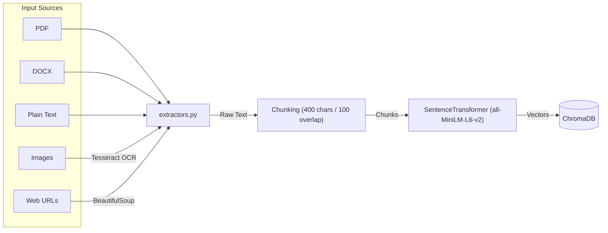
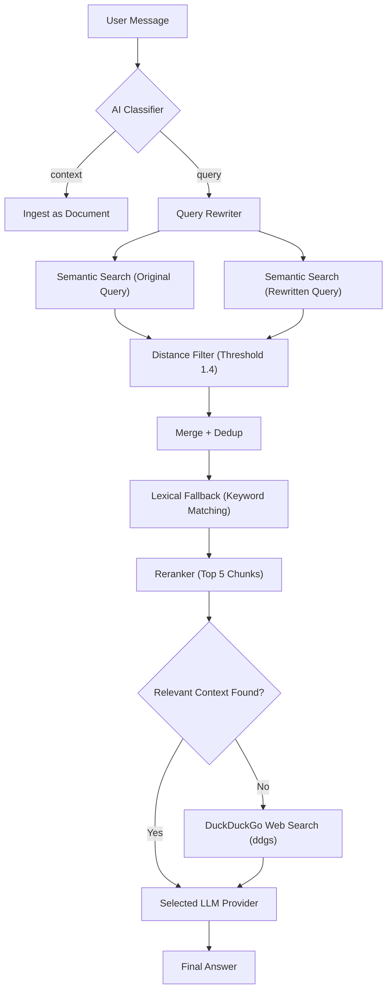
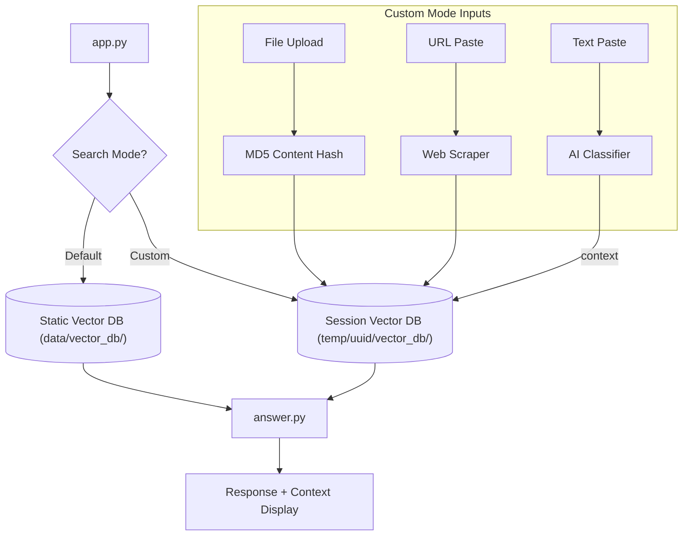

# DocuFlux AI - Dual-Mode RAG Assistant

[](https://huggingface.co/spaces/arcreactor19/DocuFlux-AI)

A production-grade, local-first RAG (Retrieval-Augmented Generation) assistant that supports both a persistent built-in knowledge base and ephemeral user-uploaded document sessions. Powered by a multi-provider LLM selector, agentic web fallback, and strict anti-hallucination grounding.

## Key Features

- **Dual-Mode Intelligence**:
  - **Default Mode**: Queries a pre-built static knowledge base (e.g., company documentation).
  - **Custom Mode**: Upload your own files or paste web links for instant, session-isolated analysis.
- **Multi-Provider LLM Selector**: Switch between LLM providers at runtime from the UI — only providers with configured API keys are shown:
  - **Local (LM Studio)** — Fully offline, no API key required
  - **Groq – Llama 3.3 70B** — Free tier (30 req/min, 14,400/day)
  - **Mistral – Small** — Free tier via La Plateforme
- **Agentic Web Fallback**: If the local database has no relevant answer, automatically queries DuckDuckGo and uses live web results as context.
- **AI Auto-Classification**: Automatically detects if you are asking a question (routes to RAG) or pasting text/URLs to be ingested as context.
- **Strict Anti-Hallucination**: The LLM is instructed to answer only from retrieved context. If context is missing, it explicitly refuses rather than fabricating.
- **Robust Multi-Format Extraction**: PDF, Word (`.docx`), Plain Text, Images (via Tesseract OCR), and Web URLs.
- **Content-Hash Deduplication**: Files are fingerprinted by MD5 hash — the same file uploaded twice is silently skipped.
- **Ephemeral Session Management**:
  - Each browser session gets a unique UUID and isolated vector database.
  - **Privacy Guarantee**: All session data is automatically wiped on reset or server shutdown.
- **Independent Chat Histories**: Switching between Default and Custom modes preserves each mode's history separately.

## Project Structure

```
DocuFlux AI/
├── app.py               # Single entry point — Assistant + Evaluation Dashboard tabs
├── packages.txt         # System dependencies (Tesseract for HF Spaces)
├── requirements.txt
├── README.md
├── .env                 # Your secrets (not committed)
├── .env.example         # Environment configuration template
│
├── core/                # All RAG logic
│   ├── config.py        # Centralized config, ENV loading, provider registry
│   ├── answer.py        # Retrieval pipeline: semantic search, reranking, web fallback, LLM
│   ├── ingest.py        # Static knowledge base ingestion script
│   ├── extractors.py    # Multi-format extraction (PDF, DOCX, OCR, Web scraping)
│   ├── session_manager.py  # Session lifecycle & temp directory management
│   └── session_ingest.py   # Per-session vector ingestion
│
├── data/
│   ├── raw/             # Static knowledge base (Markdown files)
│   └── vector_db/       # Pre-built Chroma vector database (committed to repo)
│
└── evaluation/
    ├── eval.py          # MRR, nDCG, and LLM-as-judge evaluation logic
    ├── test.py          # Test case loader
    └── tests.jsonl      # Ground-truth Q&A test cases
```

## Setup & Installation

### 1. Prerequisites
- **Python 3.10+**
- **LLM**: At least one of — LM Studio running locally, or a free API key from Groq or Mistral.
- **Tesseract OCR (Optional)**: Required only for image text extraction.
  - Windows: `winget install -e --id UB-Mannheim.TesseractOCR`
  - Linux / HF Spaces: installed automatically via `packages.txt`

### 2. Install Dependencies
```bash
python -m venv .venv
.venv\Scripts\activate       # Windows
# source .venv/bin/activate  # Linux / macOS

pip install -r requirements.txt
```

### 3. Environment Configuration
```bash
# Windows
copy .env.example .env

# Linux / macOS
# cp .env.example .env
```
Edit `.env` and fill in the API keys for whichever providers you want to use. Only providers with a key set will appear in the UI dropdown.

```env
# Free-tier LLM providers (add the ones you want)
GROQ_API_KEY=gsk_...
MISTRAL_API_KEY=...

# Local LM Studio (always available locally)
LM_STUDIO_BASE=http://127.0.0.1:1234/v1
LM_MODEL=local-model
OPENAI_API_KEY=lm-studio
```

### 4. Initialize the Built-in Knowledge Base
Place your markdown files in `data/raw/` then run:
```bash
python -m core.ingest
```
> **Note**: The pre-built vector database is committed to the repo. Only re-run this if you add or change files in `data/raw/`.

### 5. Launch the Assistant
```bash
python app.py
```
Open `http://127.0.0.1:7860` in your browser.

## Data Flow Architecture

### Ingestion Pipeline


### Query Pipeline


### Mode Architecture


## LLM Provider Configuration

| Provider | Model | Free Limits | Sign Up |
|---|---|---|---|
| Local (LM Studio) | Your local model | Unlimited | [lmstudio.ai](https://lmstudio.ai) |
| Groq | llama-3.3-70b-versatile | 14,400 req/day | [console.groq.com](https://console.groq.com) |
| Mistral | mistral-small-latest | Free tier | [console.mistral.ai](https://console.mistral.ai) |

## Evaluation Dashboard

The assistant includes a dedicated Evaluation tab to benchmark system performance using ground-truth Q&A pairs (found in `evaluation/tests.jsonl`).

### 1. Retrieval Evaluation
Measures how accurately the system finds the relevant chunks of text.
- **MRR (Mean Reciprocal Rank)**: Evaluates the rank of the first correct document.
- **nDCG (Normalized Discounted Cumulative Gain)**: Measures the usefulness of a document based on its position in the results.
- **Keyword Coverage**: Checks if the retrieved context contains essential keywords from the ground truth.

### 2. Answer Evaluation (AI-as-a-Judge)
Uses a high-level LLM (configured via `AI_EVAL_ENABLED`) to score the assistant's generated responses across three axes (1-5 scale):
- **Accuracy**: Is the information factually correct based on the context?
- **Completeness**: Does the answer address all parts of the user's query?
- **Relevance**: Is the response concise and focused on the question?

---

## System Limits
- **Max File Size**: 10 MB per file (enforced server-side).
- **Max Session Size**: 50 MB total per session.
- **Context Window**: 4,000 characters of retrieved context passed to the LLM.
- **Session Docs Panel**: Displays the latest 5 uploaded files; older ones are summarised.

